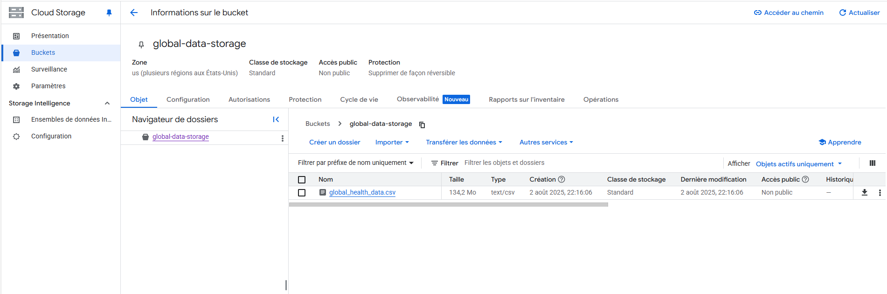
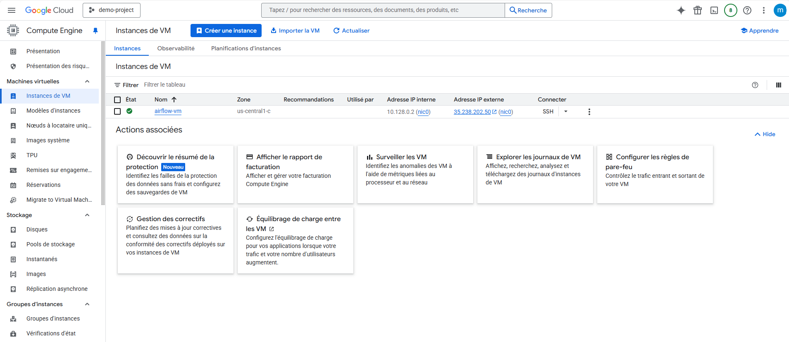
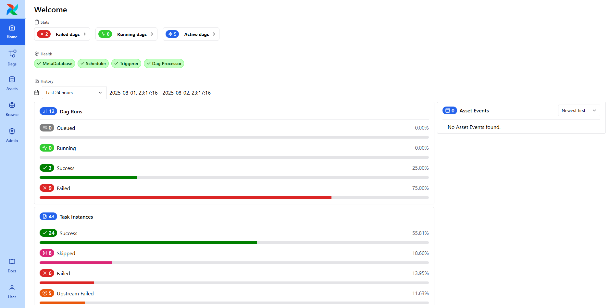
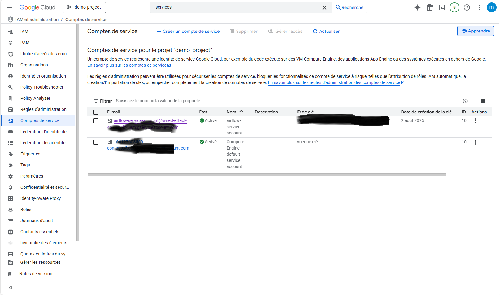
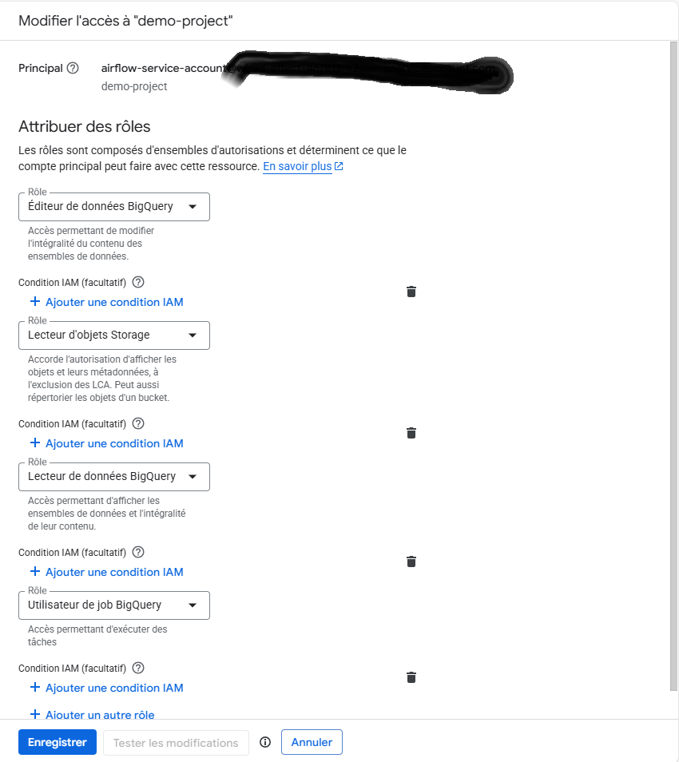
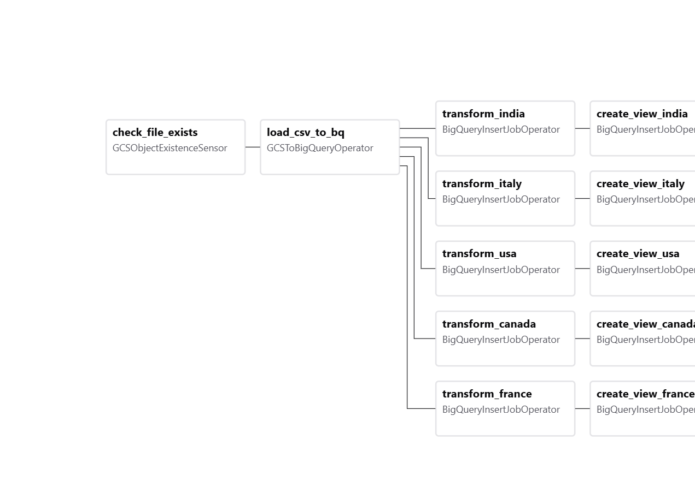
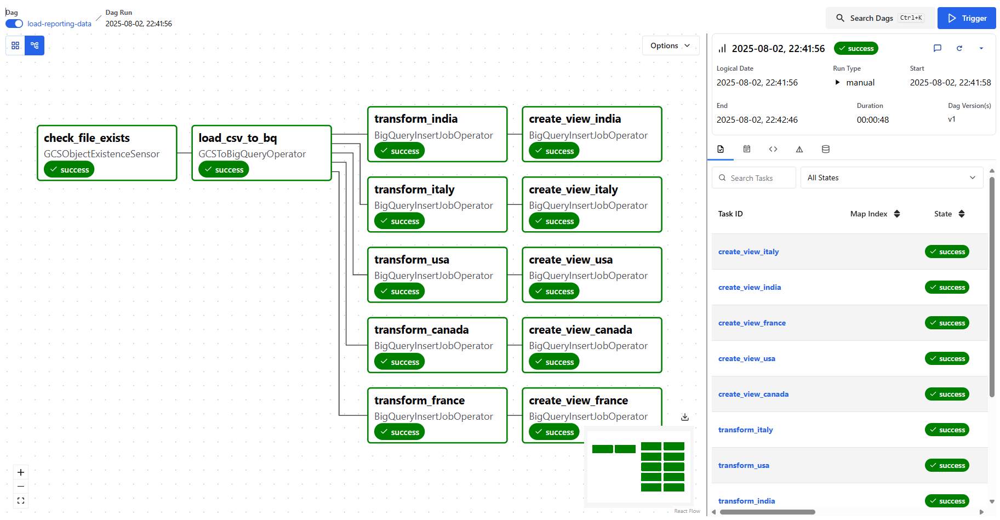

```markdown
# 🌍 GCP Health Data Pipeline

This project demonstrates how to build a data pipeline on **Google Cloud Platform** using **Apache Airflow (installed on a VM)**, **Google Cloud Storage (GCS)**, and **BigQuery**.

A CSV file containing **1 million rows** of global health data is uploaded to GCS, ingested into BigQuery, and transformed into **country-specific tables** and **reporting views** with selected fields.

---

## 📁 Project Structure

```
gcp-health-data-pipeline/
│
├── dags/
│   └── load_transform_reporting_dag.py
│
├── images/
│   ├── create_service_account.png
│   ├── create_vm.png
│   ├── dag_graph.png
│   ├── dag_run_logs.png
│   ├── install_airflow_vm.png
│   ├── service_account_roles.png
│   └── upload_gcs.png
│
└── README.md
```

---

## 🗂️ Pipeline Overview

1. 📂 Upload the CSV file to **GCS**
2. 💻 Set up **Airflow** on a **Compute Engine VM**
3. 🔐 Create a **Service Account** with access to GCS & BigQuery
4. 🛠️ Trigger a DAG that:
   - Waits for the file in GCS
   - Loads it into a staging table in BigQuery
   - Creates filtered country-specific tables
   - Creates views with only the following columns:
     - `Country`
     - `Year`
     - `Disease Name`
     - `Disease Category`
     - `Prevalence Rate`

---

## 📸 Step-by-Step Screenshots

### 1. Upload the CSV file to GCS



---

### 2. Create the Virtual Machine & Install Airflow

VM Creation:



Airflow Installation:



---

### 3. Create the Service Account



---

### 4. Assign Roles to the Service Account



---

### 5. DAG View in Airflow UI

DAG Graph:



DAG Logs:



---

## ✅ Output

- Transformed tables are stored in: `transformdataset`
- Reporting views are created in: `reportingdataset`

---

## ⚙️ Technologies Used

- Apache Airflow
- Google Cloud Storage (GCS)
- BigQuery
- Compute Engine (VM)
- IAM (Service Accounts)
- Python

---

## 📝 Author

Mohamed EN-NACIRI  
[LinkedIn](https://www.linkedin.com/in/mohamed-en-naciri-3a9988261/) | [GitHub](https://github.com/ennacirimohamed)
```
